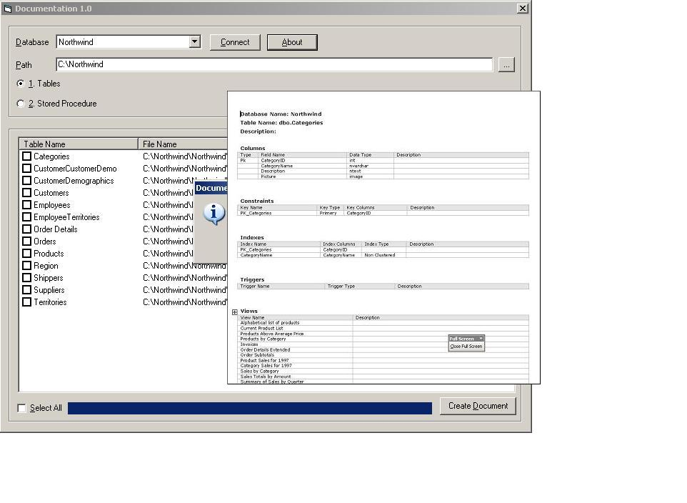

<div align="center">

## SQL Server Object Documentation


</div>

### Description

Used to Document a SQL Server Database.

Login

Select the Database to document.

Select the Path at which the documents (.doc) will be created. Just select the primery location, the application will create the folder with the database name.

Select the objects to document.

Click the Create Document Button.

The application uses SQL-DMO to document Tables and Stored Procedures of a selected SQL Server 2000 database.

The application creates .doc files for each selected SQL Server object(Table/Stored Procedure), and writes varied information about the object to the .doc file. (Required MS Word).

The application also maintains the last selected information.
 
### More Info
 
Needs MS Word and MS SQL Server 2000.

The application creates .doc files for each selected SQL Server object(Table/Stored Procedure), and writes varied information about the object to the .doc file. (Required MS Word).


<span>             |<span>
---                |---
**Submitted On**   |2006-01-02 06:10:04
**By**             |[Manish Patil](https://github.com/Planet-Source-Code/PSCIndex/blob/master/ByAuthor/manish-patil.md)
**Level**          |Intermediate
**User Rating**    |4.6 (32 globes from 7 users)
**Compatibility**  |VB 6\.0
**Category**       |[Complete Applications](https://github.com/Planet-Source-Code/PSCIndex/blob/master/ByCategory/complete-applications__1-27.md)
**World**          |[Visual Basic](https://github.com/Planet-Source-Code/PSCIndex/blob/master/ByWorld/visual-basic.md)
**Archive File**   |[SQL\_Server196153122006\.zip](https://github.com/Planet-Source-Code/manish-patil-sql-server-object-documentation__1-63890/archive/master.zip)

### API Declarations

```
SHBrowseForFolder
GetPrivateProfileString
WritePrivateProfileString
Sleep
ShellExecute
```


